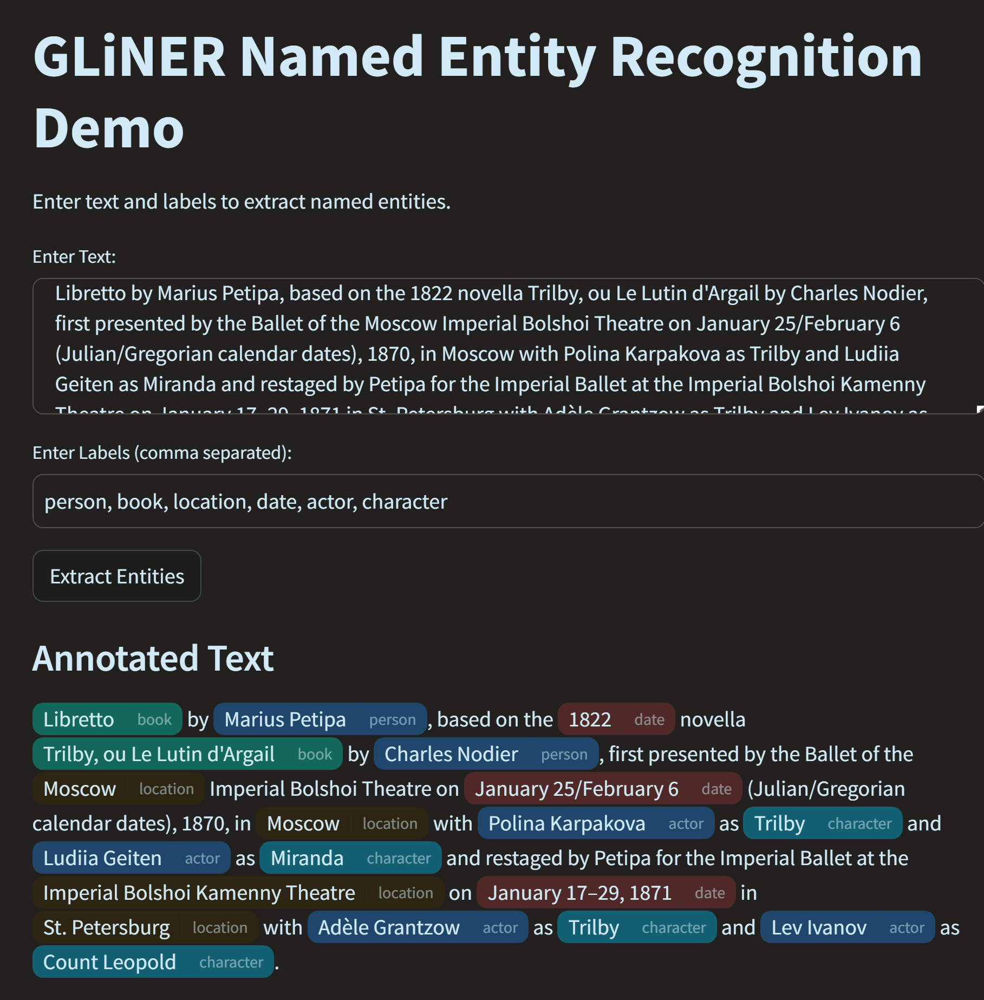

# GLiNER Named Entity Recognition Demo

This Streamlit application demonstrates the use of the GLiNER model for Named Entity Recognition (NER). The app allows users to input text and labels, and then extracts and annotates named entities in the text with different colors using the `st-annotated-text` library.

## Features

- Input text for NER processing.
- Specify entity labels (e.g., person, team, nationality).
- Extract and display annotated entities with dynamic colors.


## Installation

1. Clone the repository:
   ```bash
   git clone https://github.com/yourusername/gliner-ner-demo.git
   cd gliner-ner-demo
   ```
2. Install the required packages:

    ```bash
        pip install -r requirements.txt
    ```
3. Run the Streamlit app:
    ```bash
        streamlit run app.py
    ```
4. Open your browser and navigate to ```http://localhost:8501``` to view the app.

## Screenshot

